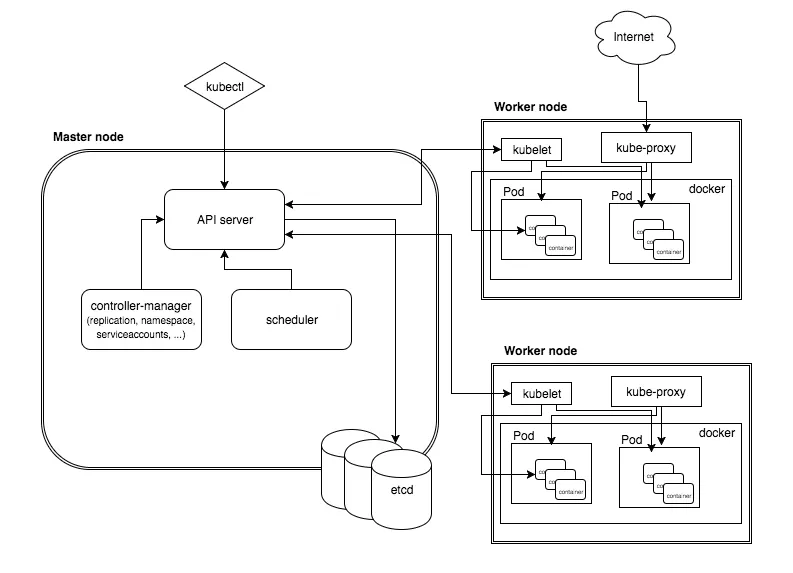

# Kubernetes Architecture and Components

Kubernetes have client-server architecture. It's possible to have multi-master setup(for high availability), but by default it'll there is a single master server which acts as controlling node and point of contact.

Master node includes - API Server, Kube-controller-manager, an etcd storage, a cloud-controller-manager, a kube-scheduler.

Worker node includes - Kubelet and kuber-proxy, container-runtime.

## Master Components:

### kube-apiserver:

This is the central management entity that receives all the REST requests for modifications (to pods, services, replication sets/controllers) serves as frontend to the cluster. Also this the only component that communicates with etcd cluster due to security reasons making sure that all the data is stored and in agreement with the service details of the deployed pods.

### etcd cluster:

a simple, distributed key value storage which is used to store kubernets cluster data (such as number of pods, their state, their namespace) API's and service discovery details.

- By default, etcd runs on 2379.

### kube-controller-manager:

It runs a no: distinct controller processes in the background(replication controller controls the number of replicas in a pod, endpoint controller and others) to regualte the shared state of cluster and to perform routine tasks.

When a change in service configuration occurs(for example, replacing the image from which pods are running or changing the configuratoin yaml file), the controller spots the change and starts working on the desired state.

### Cloud-controller-manager:

It is responsible for managing controller processes with dependencies on the underlying cloud provider (if applicable). For example, when a controller needs to check if a node was terminated or set up routes, load balancers or volumes in the cloud infrastructure, all that is handled by the cloud-controller-manager.

### Kube-Scheduler:

It helps to schedule the pods on the various nodes based on the resource utilization. It reads the service operational requirements and schedule it on the best fit node. For example, if the application needs 1GB of memory and 2 CPU cores, then the pods for that application will be scheduled on a node with at least those resources.
The scheduler runs each time there is a need to schedule pods. The scheduler must know the total resources available as well as resources allocated to existing workloads on each node.

## Worker Components:

### Kubelet:

The main service on a node, regularly taking in new or modified pod specifications(primarly the kube-apiserver) and ensuring that their pods and containers are running in the desired state.This component also reports to the master on the health of the host where it is running.

### Kube-proxy:

It's a proxy service that runs on each worker node to deal with individual host subnetting and expose services to the external world. It performs request forwarding to the correct pods/containers across the various isolated networks in a cluster.
