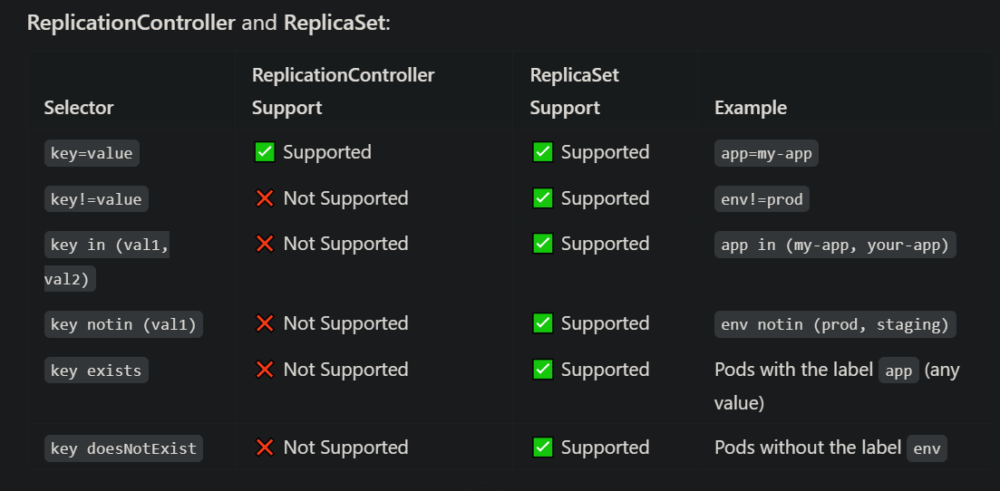

## What is Replica Set ?

Replica set is a kubernetes resource which is reponsible for maintaing a specified number of identical pods all the time. ReplicaSet automatically detect and recover from pods failures by creating new replicas to replace the failed ones, ensuring that the desired state of the application is maintained. This is called self-healing or auto-healing.

```
apiVersion: apps/v1
kind: ReplicaSet
metadata:
  name: frontend-replicaset
  labels:
    app: guestbook
    tier: frontend
spec:
    replicas: 3
    selector:
        matchLabels:
            tier: my-app
    template:
        labels:
            tier: frontend
        spec:
            containers:
            - name: php-redis
              image: us-docker.pkg.dev/google-samples/containers/gke/gb-frontend:v5
```

### You can scale replica sets using below commands

**kubectl replace -f replicasets.yml**
**kubectl scale replicas=6 -f replicasets.yml**

### Difference between Replication Controllers and Replica Sets

**ReplicationController:** The older way to manage replica pods in Kubernetes. It ensures that the desired number of pod replicas are running, but it is considered deprecated in favor of ReplicaSet.<br>
**ReplicaSet:** A more advanced and feature-rich version of ReplicationController. It provides the same functionality but includes additional features and is the recommended choice in modern Kubernetes setups.<br>

#### ReplicationController: Equality-Based Selectors Only

ReplicationController supports only equality-based selectors, meaning you can use key=value or key!=value.

**Example: Equality Selector (key=value)**

```
apiVersion: v1
kind: ReplicationController
metadata:
  name: my-app-rc
spec:
  replicas: 3
  selector:
    app: my-app       # Equality-based selector: only "app=my-app" pods will be managed
  template:
    metadata:
      labels:
        app: my-app
    spec:
      containers:
      - name: nginx
        image: nginx
```

### Set-Based Selector Examples

**Example 1: in Selector**

```
apiVersion: apps/v1
kind: ReplicaSet
metadata:
  name: my-app-rs
spec:
  replicas: 3
  selector:
    matchExpressions:
      - key: app
        operator: In
        values:
          - my-app
          - your-app    # Selects pods with "app=my-app" OR "app=your-app"
  template:
    metadata:
      labels:
        app: my-app
    spec:
      containers:
      - name: nginx
        image: nginx
```

This ReplicaSet will manage pods with app=my-app or app=your-app.


