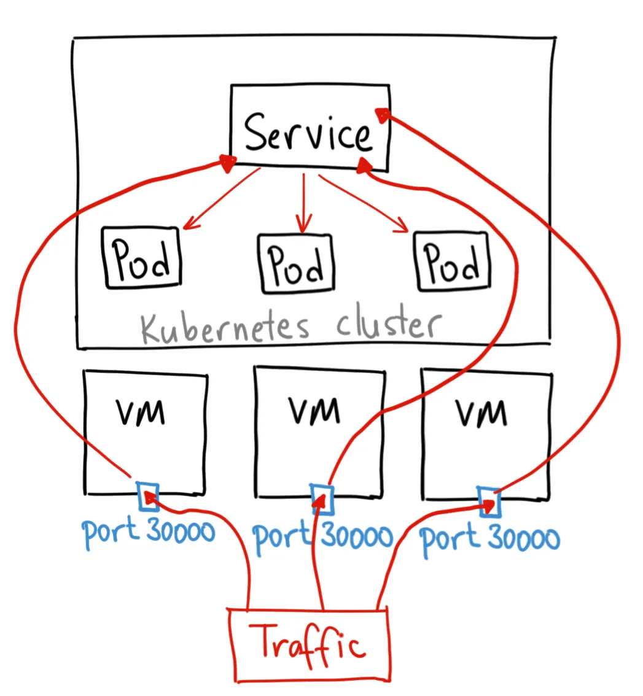

## Services

A kubernetes service is a logical abstraction for a deployed group of pods in a cluster. Since pods are ephemeral, a service enables a group of pods, to be assigned a name and unique IP address (clusterIP). As long as the service is running that IP address, it will not change.

### What are the types of Kubernetes services?

**ClusterIP.** Exposes a service which is only accessible from within the cluster.

**NodePort.** Exposes a service via a static port on each node’s IP.

**LoadBalancer.** Exposes the service via the cloud provider’s load balancer.

## NodePort

- A NodePort service is the most primitve way to get the external traffic directly to your service. NodePort, as the name implies, opens a specific port on all the Nodes, and any traffic that is sent to this port is forwarded to the service.



```
apiVersion: v1
kind: Service
metadata:
  name: my-nodeport-service
spec:
  selector:
    app: my-app
  type: NodePort
  ports:
  - name: http
    port: 80
    targetPort: 80
    nodePort: 30036
    protocol: TCP
```

### Key Components of NodePort:

- **Selector:** Identifies the Pods that the service should target.
- **NodePort:** The port that is exposed on the Node.
- **TargetPort:** The port on the Pod where the application is running.
- **Port:** The port of the ClusterIP service.
